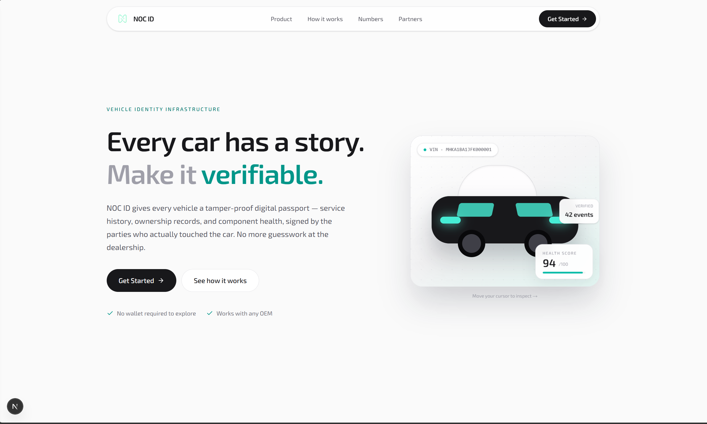
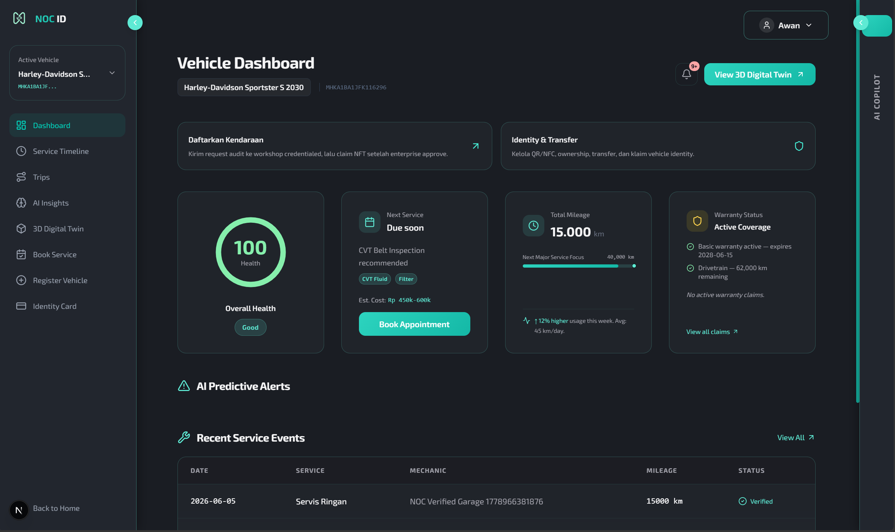
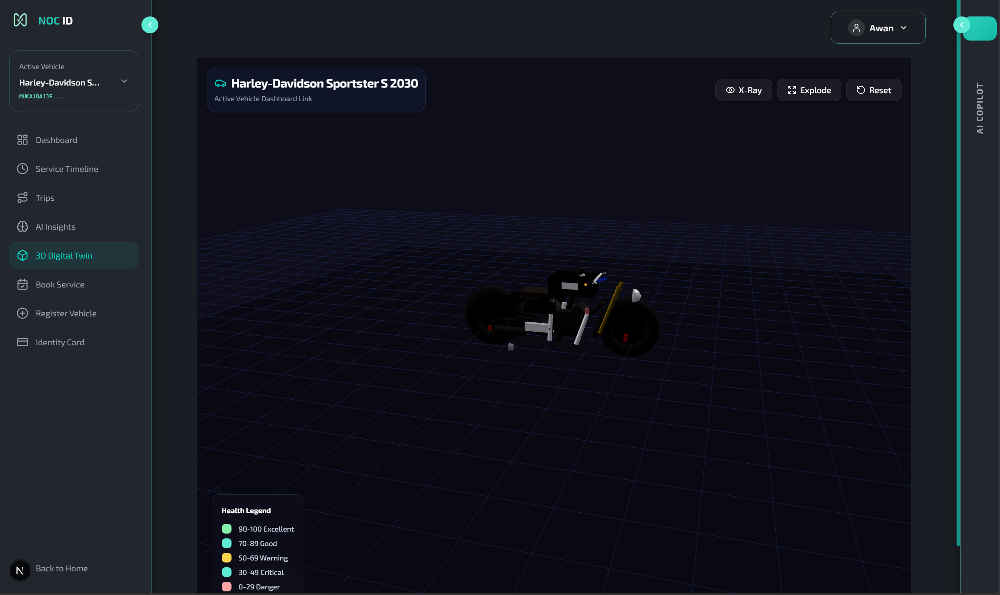
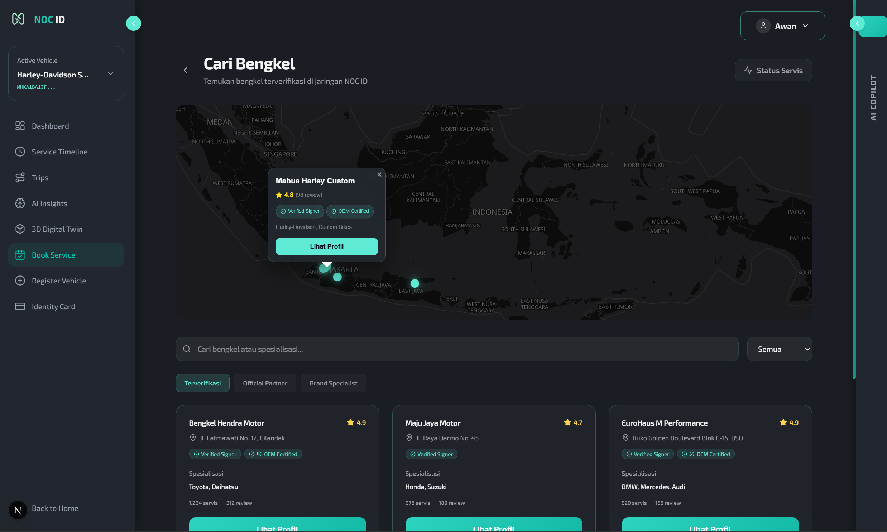
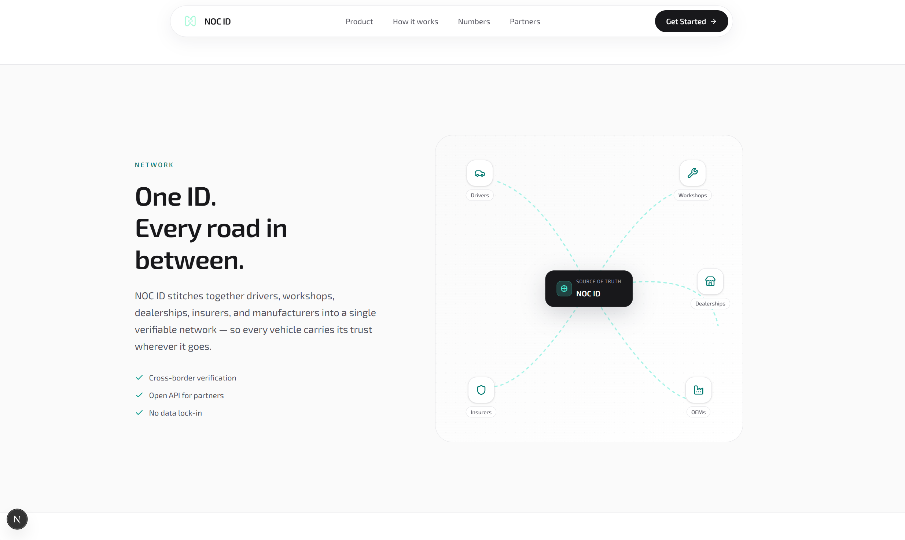
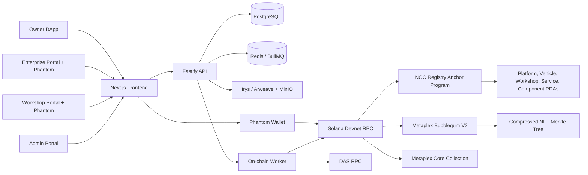

# NOC ID

**One-liner:** NOC ID is a verifiable vehicle identity network for ownership, service history, component origin, and digital twin state on Solana.

**TL;DR:** every vehicle gets a tamper-evident digital passport. Enterprises mint vehicle passports as compressed NFTs, workshops sign service and component-origin proofs, and owners see the resulting identity, timeline, and 3D twin from one app.



## What This Is

NOC ID connects owners, enterprises, workshops, and admins around a single vehicle identity layer:

- **Owners** register/login with email and password, receive an embedded Solana wallet, view active vehicles, QR/NFC identity, 3D digital twin, booking status, and verified service timeline.
- **Enterprises** connect Phantom, mint vehicle compressed NFTs, register vehicle records in the NOC Registry program, and transfer vehicles to users.
- **Workshops** connect Phantom, scan vehicle identity, process bookings, create invoices, verify component origin, anchor service logs, and update vehicle passport metadata.
- **Admins** manage roles, workshops, platform config, audit events, and dispute/review surfaces.

The app uses PostgreSQL for operational state, Solana Devnet for authorization and immutable proof records, and Metaplex Bubblegum/Core for compressed vehicle passport assets.

## Product Preview

### Owner Dashboard



### 3D Digital Twin



### Verified Workshop Discovery



### Vehicle Identity Network



## Tech Stack


| Layer | Implementation |
| --- | --- |
| Frontend | Next.js 16, React 19, TypeScript, Tailwind CSS 4, Zustand, TanStack Query, Three.js, MapLibre |
| Backend | TypeScript, Fastify 5, Zod, Prisma, BullMQ, Redis |
| Database | PostgreSQL 16 |
| Smart Contract | Rust + Anchor, program `noc_registry` |
| NFT / cNFT | Metaplex Bubblegum V2 compressed NFTs + Metaplex Core collection |
| Solana Client | `@solana/kit`, `@solana/client`, `@solana/react-hooks`, `@solana/web3.js`, Anchor IDL client |
| Metadata | Irys/Arweave for public metadata, MinIO/S3-compatible storage for private evidence |
| Payments | IDR placeholder, USDC SPL, IDRX SPL on Solana, future NOC token |

## Architecture



## Repository Layout

```text
NOC-ID/
  frontend/                         # Next.js owner, workshop, enterprise, admin portals
  backend/                          # Fastify API, Prisma schema, workers, tests
  programs/noc_registry/            # Anchor smart contract
  clients/ts/noc-registry/          # generated TS client package
  idl/noc_registry.json             # Anchor IDL used by API/frontend scripts
  scripts/devnet/                   # devnet operator, deploy, cNFT, smoke scripts
  infra/docker-compose.yml          # Postgres, Redis, MinIO
  docs/                             # implementation notes and README assets
```

## Prerequisites

- Node.js 20 or newer.
- Docker Desktop with Compose enabled.
- PowerShell on Windows.
- Phantom wallet set to Solana Devnet for enterprise/workshop/admin actions.
- A funded Devnet wallet for deploy/operator actions.
- A DAS-capable Solana RPC URL for real cNFT reads, proofs, transfers, and metadata updates. Helius Devnet, QuickNode, and Triton-style DAS RPCs work; the plain public Solana RPC is not enough for cNFT proof APIs.

## Fresh Clone Setup

Use this path when the project is being set up on a new machine.

1. Install dependencies from the repository root:

```powershell
npm install
```

2. Create backend environment file:

```powershell
Copy-Item backend\.env.example backend\.env
```

3. Edit `backend\.env` and fill the values below:

```env
JWT_SECRET=change-this-to-a-long-random-secret
SOLANA_CLUSTER=devnet
SOLANA_RPC_URL=https://api.devnet.solana.com
SOLANA_WS_URL=wss://api.devnet.solana.com
SOLANA_DAS_RPC_URL=https://devnet.helius-rpc.com/?api-key=YOUR_KEY
NOC_REGISTRY_PROGRAM_ID=GpQrQR2pQnA7ihao7yJoCceas2x1nLor1nfB5QPPhHJU
DEVNET_KEYPAIR_PATH=C:\tmp\noc-keys\noc-devnet-deployer.json
BUBBLEGUM_TREE_ADDRESS=your_tree_address
METAPLEX_CORE_COLLECTION_ADDRESS=your_collection_address
IDRX_MINT=idrxZcP8xiKkYk6XGD4uz1dxEYCWSgKDHqgjsBbwDur
CORS_ORIGIN=http://localhost:3001
```

4. Create frontend environment file:

```powershell
@'
NEXT_PUBLIC_BACKEND_URL=http://localhost:4000
NEXT_PUBLIC_SOLANA_RPC_URL=https://api.devnet.solana.com
NEXT_PUBLIC_SOLANA_WS_URL=wss://api.devnet.solana.com
'@ | Set-Content frontend\.env.local
```

5. Start local infrastructure:

```powershell
docker compose -f infra/docker-compose.yml up -d
```

This starts:

| Service | URL |
| --- | --- |
| PostgreSQL | `localhost:5432` |
| Redis | `localhost:6379` |
| MinIO API | `http://localhost:9000` |
| MinIO Console | `http://localhost:9001` |

6. Prepare the database:

```powershell
npm run backend:prisma:generate
npm run backend:prisma:migrate
npm --prefix backend run prisma:seed
```

7. Start the backend API:

```powershell
npm run backend:dev
```

8. Start the on-chain worker in another terminal:

```powershell
npm run backend:worker
```

9. Start the frontend in another terminal:

```powershell
npm --prefix frontend run dev -- -p 3001
```

10. Open the app:

```text
http://localhost:3001
```

## Running After Everything Is Already Setup

Use this path on your current machine after dependencies, `.env`, database, and devnet config already exist.

```powershell
docker compose -f infra/docker-compose.yml up -d
npm run backend:dev
npm run backend:worker
npm --prefix frontend run dev -- -p 3001
```

Optional health checks:

```powershell
npm run backend:build
npm run frontend:build
npm run devnet:preflight
npm run devnet:smoke
```

## Devnet Operator Flow

The app can run locally against Devnet. Browser actions that must be authorized by a business actor open Phantom:

- Enterprise vehicle cNFT mint.
- Enterprise vehicle transfer.
- Workshop service log anchor.
- Workshop component-origin verification.
- Workshop cNFT passport metadata update.
- Admin/enterprise credential actions when wired to wallet-signed transactions.

Operator commands:

```powershell
npm run devnet:wallet:check
npm run devnet:preflight
npm run anchor:build
npm run devnet:deploy-program
npm run devnet:init-platform -- --execute
npm run devnet:create-core-collection -- --uri https://example.com/noc-id-collection.json --execute
npm run devnet:create-bubblegum-tree -- --max-depth 14 --max-buffer-size 64 --execute
```

After deployment, update `backend\.env` with:

- `NOC_REGISTRY_PROGRAM_ID`
- `BUBBLEGUM_TREE_ADDRESS`
- `METAPLEX_CORE_COLLECTION_ADDRESS`
- `SOLANA_DAS_RPC_URL`
- `DEVNET_KEYPAIR_PATH`

Then restart backend and worker.

## Main Test Flow

1. Register a user with username, email, and password.
2. Confirm the user receives an embedded Devnet wallet address from the backend.
3. Login as enterprise with Phantom.
4. Mint a vehicle from `/enterprise/mint`; Phantom signs the Bubblegum mint and the app registers the vehicle PDA.
5. Transfer the vehicle to the registered user from `/enterprise/transfer`.
6. Login as the user and confirm the vehicle appears in active vehicles.
7. Book a verified workshop from `/dapp/book`.
8. Login as workshop with Phantom, accept the booking, start service, add serviced/replaced parts, optionally verify component origin, and send invoice.
9. Confirm payment in the app.
10. Workshop signs service anchoring and cNFT metadata update.
11. Owner opens service timeline and verifies explorer links for service, passport metadata update, and component-origin proof.

## On-chain Proof Model

| Flow | On-chain record |
| --- | --- |
| Vehicle mint | Metaplex Bubblegum `MintV2` compressed NFT leaf |
| Vehicle registration | NOC Registry `VehicleRecord` PDA |
| Ownership transfer | Bubblegum cNFT transfer + NOC transfer/ownership receipt |
| Service log | NOC Registry `ServiceLogRecord` PDA |
| Component origin | NOC Registry `ComponentOriginRecord` PDA |
| Passport update | Bubblegum `UpdateMetadataV2` cNFT metadata update |

Database state remains the operational source of truth for sessions, booking status, invoice status, role resolution, and UI queries. Solana stores immutable authorization and proof anchors.

## Useful Scripts

| Command | Purpose |
| --- | --- |
| `npm run backend:dev` | Start Fastify API with watch mode |
| `npm run backend:worker` | Start BullMQ on-chain worker |
| `npm run backend:build` | Type-check/build backend |
| `npm run frontend:build` | Build Next.js frontend |
| `npm run backend:prisma:migrate` | Run Prisma migration |
| `npm --prefix backend run prisma:seed` | Seed demo users, enterprise, workshops, vehicles |
| `npm run anchor:build` | Build Anchor program through Docker |
| `npm run devnet:deploy-program` | Deploy/upgrade `noc_registry` to Devnet |
| `npm run devnet:preflight` | Check IDL, program binary, wallet, and env |
| `npm run devnet:smoke` | Run local API/devnet smoke checks |

## Common Issues

| Issue | Fix |
| --- | --- |
| cNFT transfer/update fails with missing DAS RPC | Set `SOLANA_DAS_RPC_URL` to a DAS-capable Devnet RPC, then restart backend/frontend. |
| `ProgramAccountNotFound` during init | Deploy the Anchor program first with `npm run devnet:deploy-program`. |
| Phantom shows only network fee | Solana wallets usually highlight transaction fee; rent deposits appear as account balance changes in Explorer. |
| `AccountNotInitialized` after contract changes | Rebuild and redeploy the Anchor program, then restart backend/worker. |
| Backend cannot connect to DB | Start Docker Compose and verify `DATABASE_URL` in `backend\.env`. |
| Frontend calls wrong API URL | Check `NEXT_PUBLIC_BACKEND_URL` in `frontend\.env.local`. |

## Current Devnet Constants

| Name | Value |
| --- | --- |
| IDRX SPL mint | `idrxZcP8xiKkYk6XGD4uz1dxEYCWSgKDHqgjsBbwDur` |
| Deprecated IDRX prefix | `idrxTdN` |
| Default cluster | `devnet` |
| Backend default port | `4000` |
| Frontend recommended local port | `3001` |

