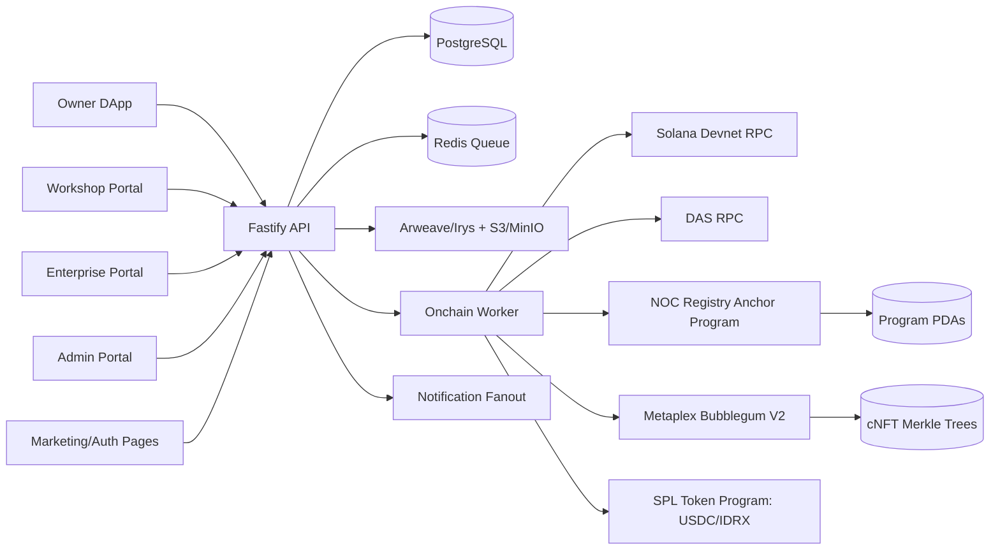
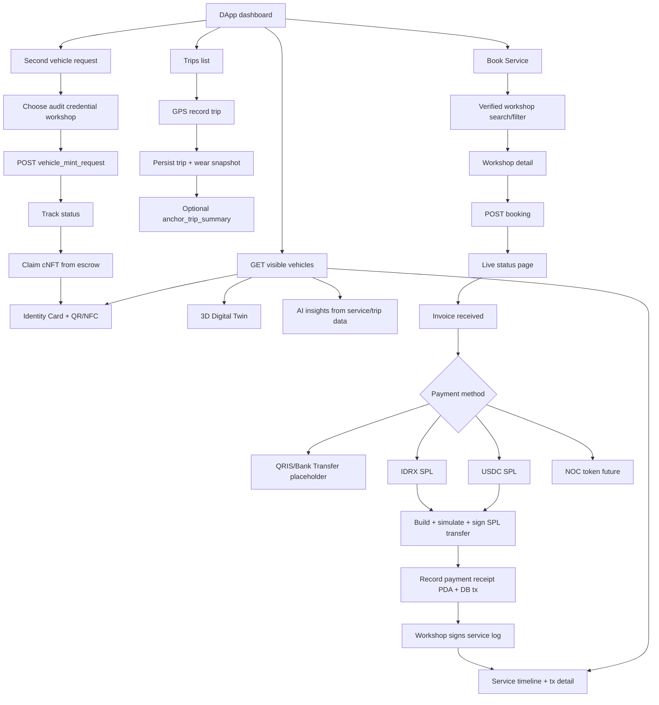
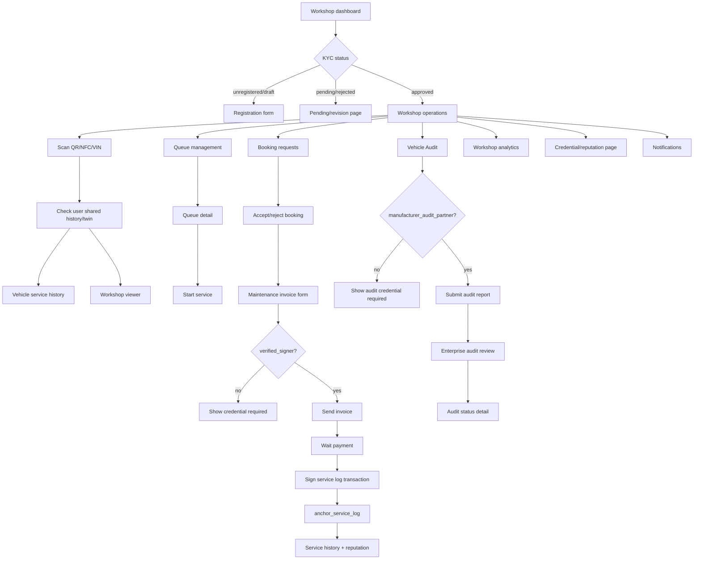
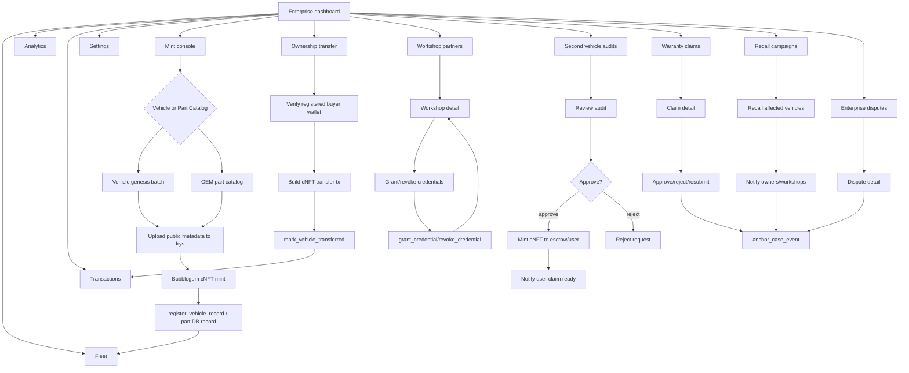
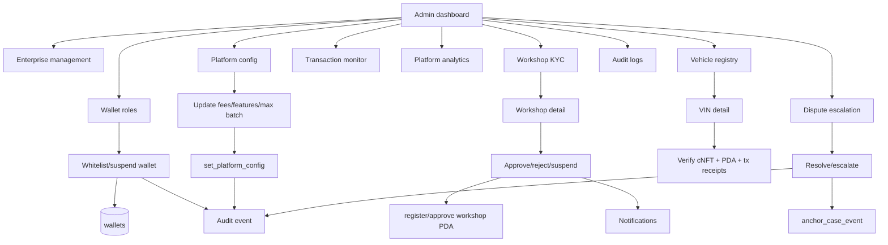

# NOC ID Backend + Smart Contract Devnet Implementation Plan v2

**Status:** Local devnet surface implemented | **Scope:** Backend, Anchor registry program, Docker build, devnet smoke/preflight scripts, storage/payment policy, frontend API hydration, wallet signature auth, Anchor transaction plans, DAS verification

## 1. Tech Stack

| Layer | Decision | Notes |
|---|---|---|
| Smart contract | Rust + Anchor | `programs/noc_registry`; registry, authorization, hashes, payment receipts. |
| cNFT | Metaplex Bubblegum V2 + Core Collection | Vehicle passports and OEM part catalog cNFTs are minted by worker, then referenced by registry PDAs. |
| Solana SDK | `@solana/kit`, `@solana/client`, `@solana/react-hooks` | Frontend already uses framework-kit style provider. |
| Backend | TypeScript + Fastify + Zod | Domain route modules under `backend/src/modules`. |
| Database | PostgreSQL + Prisma | Canonical app state and reconciliation. |
| Queue | BullMQ + Redis | On-chain worker, retries, notifications. |
| Public metadata | Arweave via Irys | Vehicle/part metadata JSON and public image/model references. |
| Private evidence | S3-compatible storage, local MinIO | KTP/BPKB/STNK/invoice/diagnostic files; on-chain stores hash only. |
| Payments | IDR placeholder, USDC SPL, IDRX SPL, future NOC | IDRX mint locked to `idrxZcP8xiKkYk6XGD4uz1dxEYCWSgKDHqgjsBbwDur`; deprecated `idrxTdN...` rejected. |
| Deployment | Devnet program, managed backend/Postgres/Redis, Vercel frontend | DAS-enabled RPC required for cNFT reads. |

References: [Solana program deployment](https://solana.com/docs/core/programs/program-deployment), [Solana JS SDK](https://solana.com/docs/clients/official/javascript), [Metaplex Bubblegum](https://www.metaplex.com/docs/en/smart-contracts/bubblegum), [Solana Metaplex metadata](https://solana.com/docs/tokens/metaplex), [IDRX supported chains](https://docs.idrx.co/introduction/supported-chain-and-contract-address), [Solana payments](https://solana.com/docs/payments/accept-payments).

## 2. Implemented Scaffold

```text
NOC-ID/
  backend/
    package.json
    tsconfig.json
    prisma/schema.prisma
    src/main.ts
    src/config/env.ts
    src/modules/{auth,admin,vehicles,workshops,bookings,invoices,payments,service-logs,mints,audits,credentials,warranties,disputes,recalls,notifications,analytics,solana,storage,webhooks}
    src/workers/onchainWorker.ts
  programs/noc_registry/
    Anchor.toml
    Cargo.toml
    programs/noc_registry/Cargo.toml
    programs/noc_registry/src/lib.rs
    tests/noc_registry.ts
  idl/noc_registry.json
  clients/ts/noc-registry/
  scripts/devnet/{airdrop.ts,create-bubblegum-tree.ts,upload-metadata.ts,smoke-devnet.ts,deploy-program.ps1}
  infra/docker-compose.yml
  infra/env.example
  frontend/src/lib/api/client.ts
```

## 3. DFD Level 0



## 4. Data Model

Postgres canonical tables:

- Identity/RBAC: `users`, `wallets`, `sessions`, `enterprises`, `workshops`, `workshop_registrations`, `workshop_credentials`.
- Vehicle/cNFT: `vehicles`, `part_catalog_items`, `vehicle_mint_requests`, `vehicle_audits`.
- Service lifecycle: `bookings`, `invoices`, `payments`, `service_logs`, `warranty_claims`, `disputes`, `recalls`.
- Telemetry: `trips`, `trip_points`, `component_wear_snapshots`.
- Ops: `notifications`, `tx_receipts`, `onchain_jobs`, `audit_events`.

Anchor accounts:

- `PlatformConfig`: superadmin, fee bps, gas subsidy bps, max batch size, paused.
- `EnterpriseRecord`: enterprise authority and metadata hash.
- `WorkshopRecord`: workshop authority, KYC status, metadata hash.
- `CredentialRecord`: workshop credential, issuer, expiry, revoked flag.
- `VehicleRecord`: VIN hash, owner, cNFT asset/tree/leaf refs, metadata hash.
- `ServiceLogRecord`: vehicle, workshop, odometer, invoice/parts/evidence hashes.
- `TripSummaryRecord`: optional trip metric hash anchor.
- `CaseRecord`: warranty/dispute/recall hash anchor.
- `PaymentReceiptRecord`: payer, recipient, mint, amount, invoice hash.

## 5. Marketing, Auth, RBAC Flow

Covers `/`, `/pricing`, `/login`, `/register`, `/admin/login`, `/enterprise/login`, `/enterprise/register`, `/workshop/login`, `/workshop/register`.

```mermaid
flowchart TD
  Landing[Landing/Pricing] --> Choose{Login/Register Type}
  Choose --> UserLogin[User phone/email/wallet login]
  Choose --> WorkshopLogin[Workshop login/register]
  Choose --> EnterpriseLogin[Enterprise login/register]
  Choose --> AdminLogin[Admin wallet login]

  UserLogin --> AuthAPI[Auth API: nonce/OTP/session]
  WorkshopLogin --> KYC[Workshop registration draft + KYC submit]
  EnterpriseLogin --> EntReg[Enterprise account request]
  AdminLogin --> WalletVerify[Wallet signature verify]

  AuthAPI --> Session[(sessions)]
  KYC --> WorkshopReg[(workshop_registrations)]
  EntReg --> Enterprises[(enterprises)]
  WalletVerify --> RBAC[(wallets + roles)]

  Session --> Guard[PortalGuard]
  RBAC --> Guard
  Guard --> DApp[/dapp]
  Guard --> WorkshopPortal[/workshop]
  Guard --> EnterprisePortal[/enterprise]
  Guard --> AdminPortal[/admin]
```

Backend endpoints:

- `POST /auth/nonce`
- `POST /auth/wallet/verify`
- `POST /auth/otp/request`
- `POST /auth/otp/verify`
- `POST /auth/logout`
- `POST /workshops/registrations`
- `POST /admin/wallets`

Implementation notes:

- Wallet auth uses backend nonce, wallet `signMessage`, and backend Ed25519 verification against the Solana address.
- Wallet login messages include role, address, nonce, and issued-at timestamp; backend rejects malformed or expired messages.
- Frontend stores the backend-issued JWT in the user session for follow-up API calls.

## 6. Owner DApp Flow

Covers `/dapp`, `/dapp/identity`, `/dapp/viewer`, `/dapp/insights`, `/dapp/notifications`, `/dapp/timeline`, `/dapp/timeline/[txSig]`, `/dapp/book`, `/dapp/book/[workshopId]`, `/dapp/book/status`, `/dapp/trips`, `/dapp/trips/record`, `/dapp/trips/[tripId]`, `/dapp/register-vehicle`, `/dapp/register-vehicle/status`.



Payment implementation rules:

- IDRX amount defaults to invoice IDR amount.
- `POST /payments/intents` creates a payment intent with `currency = IDRX`, mint `idrxZc...`, and workshop treasury recipient.
- Frontend must show transaction summary, simulate, request wallet signature, then submit signature.
- Backend rejects deprecated `idrxTdN...` mint prefix.
- `record_payment_receipt` anchors invoice/payment hash after transfer confirmation.

## 7. Workshop Flow

Covers `/workshop`, `/workshop/register`, `/workshop/pending`, `/workshop/scan`, `/workshop/maintenance`, `/workshop/history`, `/workshop/analytics`, `/workshop/reputation`, `/workshop/viewer`, `/workshop/verification`, `/workshop/notifications`, `/workshop/vehicle/[vin]`, `/workshop/queue`, `/workshop/queue/[queueId]`, `/workshop/bookings`, `/workshop/bookings/[bookingId]`, `/workshop/audit`, `/workshop/audit/new`, `/workshop/audit/[auditId]`.



Backend endpoints:

- `GET /workshops/me`
- `GET /workshops/queue`
- `PATCH /bookings/:bookingId/status`
- `POST /service-logs/draft`
- `POST /service-logs/:serviceLogId/build-tx`
- `POST /service-logs/:serviceLogId/submit-signed`
- `POST /solana/simulate`
- `GET /solana/das/vehicles/:vehicleId`

Implementation notes:

- `build-tx` checks `verified_signer` credential before returning anchor action summary, account hints, and hash payloads.
- `build-tx` now returns an Anchor transaction plan with discriminator, base64 instruction data, account metas, signer summary, PDA seeds, and missing deployed-account list.
- `POST /solana/simulate` supports summary-only safety checks and RPC `simulateTransaction` for base64 transactions before wallet signing.
- `GET /solana/das/vehicles/:vehicleId` verifies DB cNFT references against a DAS-enabled RPC and returns a safe false result for unavailable demo asset IDs.

## 8. Enterprise Flow

Covers `/enterprise`, `/enterprise/mint`, `/enterprise/transfer`, `/enterprise/models`, `/enterprise/fleet`, `/enterprise/analytics`, `/enterprise/transactions`, `/enterprise/settings`, `/enterprise/workshops`, `/enterprise/workshops/[workshopId]`, `/enterprise/workshops/[workshopId]/credentials`, `/enterprise/recalls`, `/enterprise/recalls/[campaignId]`, `/enterprise/warranties`, `/enterprise/warranties/[claimId]`, `/enterprise/disputes`, `/enterprise/disputes/[disputeId]`, `/enterprise/audits`, `/enterprise/audits/[auditId]`.



Backend endpoints:

- `POST /mints/vehicle-batch`
- `POST /mints/part-catalog`
- `POST /audits/:auditId/approve`
- `GET /audits/vehicle-requests`
- `GET /audits/reports`
- `POST /admin/workshops/:workshopId/approve`
- `POST /credentials`
- `POST /credentials/:credentialId/revoke`
- `GET /warranties`, `POST /warranties`, `PATCH /warranties/:claimId/status`
- `GET /disputes`, `POST /disputes`, `POST /disputes/:disputeId/resolve`
- `GET /recalls`, `POST /recalls`
- `POST /vehicles/:vehicleId/transfer`

Implementation notes:

- Credential grant/revoke enqueues `grant_credential` and `revoke_credential`.
- Warranty/dispute/recall decisions create DB records, audit events, case hashes, and `anchor_case_event` jobs.
- Recall issue creates owner notifications.
- Vehicle transfer queues `mark_vehicle_transferred` and updates canonical ownership state.
- Frontend vehicle mint request, audit, and trip stores now sync with backend APIs while keeping local optimistic UX.

## 9. Admin Flow

Covers `/admin`, `/admin/roles`, `/admin/enterprises`, `/admin/transactions`, `/admin/analytics`, `/admin/config`, `/admin/audit`, `/admin/workshops`, `/admin/workshops/[workshopId]`, `/admin/vehicles`, `/admin/vehicles/[vin]`, `/admin/disputes`, `/admin/disputes/[disputeId]`.



## 10. Storage Policy

- Public immutable metadata on Arweave/Irys:
  - vehicle NFT JSON, part NFT JSON, public thumbnails, non-sensitive manifest.
  - fields: `name`, `description`, `image`, `attributes`, `external_url`, `properties.files`, `noc.metadata_hash`.
- Private evidence on S3/MinIO:
  - KTP, BPKB, STNK, invoice PDF, diagnostic report, sensitive audit photos.
  - DB stores encrypted object key; on-chain stores SHA-256 hash only.
- PostgreSQL:
  - mutable lifecycle state, role links, queue state, notifications, payment reconciliation.
- On-chain:
  - authorization, credential state, cNFT refs, immutable hashes, payment receipt hash.

Implemented storage/API policy:

- `POST /storage/metadata/upload` hashes public JSON metadata and returns an Irys-style pending URI.
- `POST /storage/evidence/register` returns private object key plus SHA-256 hash and marks evidence as non-public.
- `scripts/devnet/upload-metadata.ts` calls the backend metadata endpoint and falls back to deterministic local hash output.

## 11. Devnet Milestones

1. Install backend dependencies and run `docker compose -f infra/docker-compose.yml up -d`.
2. Copy `infra/env.example` into backend/frontend env files.
3. Run `npm --prefix backend run prisma:generate` and `npm --prefix backend run prisma:migrate`.
4. Build Anchor program with `NO_DNA=1 anchor build` from `programs/noc_registry`.
   - If running from the Ubuntu terminal manually: `bash /mnt/d/Projekan/Web3/NOC-ID/scripts/devnet/build-anchor-wsl.sh`.
   - Default from Windows/Codex uses Docker: `npm run anchor:build`.
   - If WSL is visible to PowerShell/Codex: `npm run anchor:build:wsl`.
5. Replace placeholder program id after deploy and regenerate `idl/noc_registry.json`.
6. Wire real Irys upload in `scripts/devnet/upload-metadata.ts`.
   - Current state: backend-backed metadata hash/URI pipeline implemented; funded Irys uploader still requires operator wallet approval.
7. Wire real Bubblegum V2 tree creation in `scripts/devnet/create-bubblegum-tree.ts`.
   - Current state: RPC/DAS/tree/collection preflight implemented; real tree creation still requires funded authority and explicit transaction approval.
8. Implement on-chain worker handlers for vehicle mint, payment receipt, service log, credential, case event.
   - Current state: worker consumes all planned job names, records DB side effects, creates tx receipts when a signature is supplied, and marks jobs confirmed in local devnet mode.
9. Replace frontend localStorage stores one by one with API hydration.
   - Current state: vehicle, booking, vehicle mint request, enterprise audit, and trip stores hydrate/sync with backend; wallet login goes through backend signature verification.
10. Run `scripts/devnet/smoke-devnet.ts`.
   - Current state: smoke checks backend health, vehicles, workshops, bookings, payment config, on-chain jobs, and Solana devnet RPC health.

11. Prepare devnet operator scripts.
   - Current state: `devnet:preflight`, `devnet:wallet:check`, `devnet:wallet:create`, `devnet:init-platform`, `devnet:create-core-collection`, `devnet:create-bubblegum-tree`, `devnet:mint-vehicle-cnft`, and `devnet:register-vehicle-record` are wired as dry-run-first scripts.
   - Remaining operator input: funded devnet wallet path via `DEVNET_KEYPAIR_PATH` or `--keypair`.

## 12. Acceptance Tests

- User can login, see backend vehicles, view identity/timeline/twin, book service, pay with IDRX, and see service tx receipt.
- Workshop can register, pass KYC, receive credential, process booking, invoice, and anchor service log.
- Enterprise can mint vehicle cNFT, mint part catalog, transfer ownership, review second-vehicle audit mint, grant credential, issue recall, resolve warranty/dispute.
- Admin can whitelist wallets, approve workshops, update platform config, inspect vehicles, resolve disputes, and see audit trail.
- Every on-chain action stores signature, slot, confirmation status, program id, cluster, and explorer URL.
- No devnet-critical flow uses localStorage as source of truth.

## 13. Safety Rules

- Never request or store private keys, seed phrases, or keypair JSON in the app.
- Default cluster is devnet/localnet only.
- Simulate every transaction before wallet signature.
- Show transaction summary before signing: action, cluster, fee payer, recipient, amount, mint, affected vehicle.
- Treat all RPC/DAS/metadata input as untrusted; validate owner, discriminator, account length, and expected mint.
